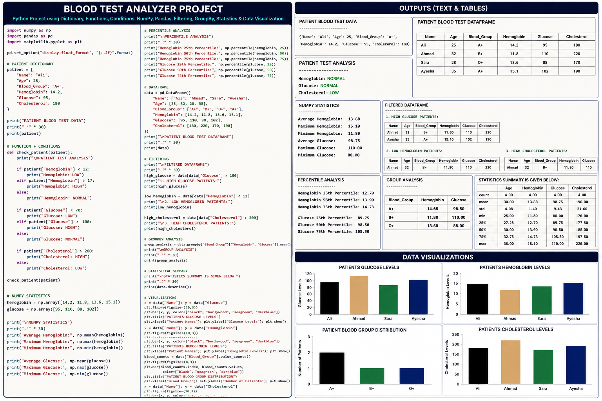

# 🧬 **Patient Blood Test Analyzer**

<p align="center">
  
</p>

<p align="center">
  <b>🧬 Computational Biology • 🐍 Python • 🔢 NumPy • 🐼 Pandas • 📊 Matplotlib</b>
</p>

<p align="center">
  <b>Patient Data Analysis • Statistical Analysis • Filtering • GroupBy • Visualization</b>
</p>

---

## 🚀 **Project Overview**

**Patient Blood Test Analyzer** is a Python-based **Computational Biology and Biological Data Analysis project** developed to analyze structured patient blood-test data and extract meaningful computational insights.

The project demonstrates a complete workflow from **patient data storage** to **biological data analysis, statistical calculations, filtering, group-based analysis, and visualization**.

It combines programming concepts with biological measurements such as:

🧑 **Patient Information**
🎂 **Age**
🩸 **Blood Group**
🧪 **Hemoglobin**
🧪 **Glucose**
🧪 **Cholesterol**

The main goal is to transform raw patient measurements into **structured data, statistical results, comparisons, and visual insights**.

---

# 🎯 **Project Objectives**

This project focuses on developing practical skills in:

* 🗂️ Patient data management
* 🐍 Python programming
* ⚙️ Functions and conditional logic
* 🔢 NumPy numerical analysis
* 📐 Percentile calculations
* 🐼 Pandas DataFrame manipulation
* 🔎 Data filtering
* 🧬 Blood-group based analysis
* 📊 Statistical summaries
* 📈 Biological data visualization
* 🧠 Computational Biology thinking

---

# 🧰 **Technologies & Libraries**

| Technology              | Purpose                                |
| ----------------------- | -------------------------------------- |
| 🐍 **Python**           | Core programming and analysis          |
| 🔢 **NumPy**            | Numerical and statistical calculations |
| 🐼 **Pandas**           | DataFrame and data manipulation        |
| 📊 **Matplotlib**       | Biological data visualization          |
| 📓 **Jupyter Notebook** | Interactive analysis                   |

---

# 🩸 **Analyzed Patient Parameters**

| Parameter          | Description               |
| ------------------ | ------------------------- |
| 🧑 **Name**        | Patient identification    |
| 🎂 **Age**         | Patient age               |
| 🩸 **Blood Group** | Blood-group category      |
| 🧬 **Hemoglobin**  | Hemoglobin measurement    |
| 🧪 **Glucose**     | Blood glucose measurement |
| 🧪 **Cholesterol** | Cholesterol measurement   |

---

# ⚙️ **Core Features**

## 🗂️ **1. Patient Data Using Dictionaries**

Patient information is initially stored using Python dictionaries.

```python
patient = {
    "Name": "Ali",
    "Age": 25,
    "Blood_Group": "A+",
    "Hemoglobin": 14.2,
    "Glucose": 95,
    "Cholesterol": 180
}
```

This provides a simple and organized way to represent individual patient information.

---

## ⚙️ **2. Functions & Conditional Analysis**

Reusable functions are used to analyze patient measurements.

Conditional statements classify values into categories such as:

```text
LOW
NORMAL
HIGH
```

This demonstrates how computational rules can be applied to biological measurements.

---

## 🔢 **3. NumPy Numerical Analysis**

Numerical patient measurements are converted into NumPy arrays.

```python
hemoglobin = np.array([14.2, 11.8, 13.6, 15.1])

glucose = np.array([95, 110, 88, 102])
```

The project performs numerical calculations such as:

* **Mean**
* **Maximum**
* **Minimum**

This provides a quick numerical overview of the dataset.

---

## 📐 **4. Percentile Analysis**

The project calculates:

* **25th Percentile**
* **50th Percentile**
* **75th Percentile**

for selected blood-test measurements.

Percentile analysis helps understand how individual measurements are distributed within the dataset.

---

# 🐼 **5. Pandas DataFrame Analysis**

Patient information is converted into a structured DataFrame.

| Name   | Age | Blood Group | Hemoglobin | Glucose | Cholesterol |
| ------ | --: | ----------- | ---------: | ------: | ----------: |
| Ali    |  25 | A+          |       14.2 |      95 |         180 |
| Ahmad  |  32 | B+          |       11.8 |     110 |         220 |
| Sara   |  28 | O+          |       13.6 |      88 |         170 |
| Ayesha |  35 | A+          |       15.1 |     102 |         190 |

The DataFrame allows efficient:

**Filtering → Grouping → Statistical Analysis → Visualization**

---

# 🔎 **6. Data Filtering**

Boolean filtering is used to select specific patient records.

### 🧪 High Glucose

```python
data[data["Glucose"] > 100]
```

### 🩸 Low Hemoglobin

```python
data[data["Hemoglobin"] < 12]
```

### 🧪 High Cholesterol

```python
data[data["Cholesterol"] > 200]
```

This demonstrates how specific biological conditions can be computationally identified.

---

# 🧬 **7. Blood Group GroupBy Analysis**

The project performs group-based analysis using Pandas:

```python
data.groupby("Blood_Group")[["Hemoglobin", "Glucose"]].mean()
```

This groups patients according to their blood group and calculates average measurements.

It demonstrates how **categorical biological information** can be used to analyze **numerical patient measurements**.

---

# 📊 **8. Statistical Summary**

The project uses:

```python
data.describe()
```

to generate a descriptive statistical summary containing:

* Count
* Mean
* Standard Deviation
* Minimum
* 25%
* 50%
* 75%
* Maximum

This provides an overall statistical view of the numerical patient data.

---

# 📈 **Data Visualization**

The project converts patient measurements into visual graphs using **Matplotlib**.

### 🧪 Glucose Level Chart

Compares glucose levels between patients.

### 🩸 Hemoglobin Level Chart

Compares hemoglobin measurements between patients.

### 🧬 Blood Group Distribution

Shows the number of patients belonging to different blood groups.

### 🧪 Cholesterol Level Chart

Compares cholesterol measurements between patients.

These visualizations make numerical differences easier to understand.

---

# 🖼️ **Project Visualization**

<p align="center">
  
</p>

The project image provides a visual overview of the **code, analysis outputs, and data visualizations**.

---

# 🔄 **Complete Analysis Workflow**

```text
🧑 Patient Data
       ↓
🗂️ Python Dictionary
       ↓
⚙️ Functions & Conditions
       ↓
🔢 NumPy Arrays
       ↓
📐 Numerical Statistics
       ↓
📊 Percentile Analysis
       ↓
🐼 Pandas DataFrame
       ↓
🔎 Data Filtering
       ↓
🧬 Blood Group GroupBy
       ↓
📋 Statistical Summary
       ↓
📈 Matplotlib Visualization
       ↓
🧠 Biological Data Insights
```

---

# 🧠 **Concepts Demonstrated**

| Concept             | Implementation            |
| ------------------- | ------------------------- |
| 🗂️ **Dictionary**  | Patient data storage      |
| ⚙️ **Functions**    | Reusable analysis         |
| 🔀 **Conditions**   | Biological classification |
| 🔢 **NumPy Arrays** | Numerical data            |
| 📐 **Percentiles**  | Distribution analysis     |
| 🐼 **DataFrame**    | Structured patient data   |
| 🔎 **Filtering**    | Patient selection         |
| 🧬 **GroupBy**      | Blood-group analysis      |
| 📊 **Describe**     | Statistical summary       |
| 📈 **Matplotlib**   | Visualization             |
| 📊 **Bar Charts**   | Patient comparison        |

---

# 💡 **Benefits of the Project**

### 🧬 **Biological Data Analysis**

Provides practical experience analyzing structured patient blood-test measurements.

### 🐍 **Python Programming**

Strengthens knowledge of:

**Variables → Dictionaries → Lists → Functions → Conditions → Loops**

### 🔢 **NumPy Skills**

Develops practical experience with:

**Arrays → Mean → Maximum → Minimum → Percentiles**

### 🐼 **Pandas Skills**

Provides experience with:

**DataFrames → Filtering → GroupBy → Statistical Summaries**

### 📊 **Visualization Skills**

Demonstrates how biological measurements can be converted into understandable graphs.

### 🧠 **Computational Biology**

Shows how biological information can be combined with programming and data analysis to produce computational insights.

---

# 🔬 **Analytical Insights**

The analyzer can computationally identify patterns such as:

* Patients with relatively higher glucose values
* Patients with lower hemoglobin values
* Patients with higher cholesterol values
* Blood-group-wise average measurements
* Patient blood-group distribution
* Differences between individual measurements
* Overall statistical characteristics of the dataset

### **Raw Data → Analysis → Statistics → Visualization → Insight**

---

# 🚀 **Future Improvements**

The project can be expanded with:

* 📂 CSV file support
* 📊 Excel file support
* 👥 Larger patient datasets
* 🧪 Additional blood-test parameters
* 🔗 Correlation analysis
* 🔥 Heatmap visualization
* 📈 Distribution plots
* 📊 Interactive dashboards
* 🤖 Machine Learning classification
* 💾 Automated patient reports
* 🧬 Large-scale biological datasets

---

# ▶️ **How to Run**

### **1. Clone Repository**

```bash
git clone <your-repository-url>
```

### **2. Install Libraries**

```bash
pip install -r requirements.txt
```

### **3. Run Project**

```bash
python patient_blood_analyzer.py
```

The program will generate the patient analysis, DataFrames, filtering results, statistical summaries, and visualizations.

---

# 📁 **Project Structure**

```text
Patient-Blood-Test-Analyzer/
│
├── patient_blood_analyzer.py
├── patient_blood_analyzer.png
├── README.md
└── requirements.txt
```

---

# 📦 **Requirements**

Create `requirements.txt`:

```text
numpy
pandas
matplotlib
```

Install dependencies:

```bash
pip install -r requirements.txt
```

---

# 🌱 **Learning Outcomes**

After completing this project, the following concepts are practiced:

```text
Python
  ↓
Biological Data
  ↓
NumPy
  ↓
Pandas
  ↓
Filtering
  ↓
GroupBy
  ↓
Statistics
  ↓
Visualization
  ↓
Computational Biology
```

This project builds a strong foundation for more advanced **Computational Biology, Biological Data Science, Genomic Analysis, and Machine Learning projects**.

---

# ⭐ **Project Highlights**

| Category                  | Details                     |
| ------------------------- | --------------------------- |
| 🧬 **Domain**             | Computational Biology       |
| 🐍 **Language**           | Python                      |
| 🩸 **Dataset**            | Patient Blood-Test Data     |
| 🔢 **Numerical Analysis** | NumPy                       |
| 🐼 **Data Analysis**      | Pandas                      |
| 🔎 **Filtering**          | Boolean Conditions          |
| 🧬 **Group Analysis**     | Blood Group GroupBy         |
| 📊 **Statistics**         | Mean, Percentiles, Describe |
| 📈 **Visualization**      | Matplotlib                  |
| 📊 **Charts**             | Bar Charts                  |

---

# ⚠️ **Disclaimer**

This project is created for **educational and computational analysis purposes**.

The classifications and thresholds used in this project are examples for programming and data-analysis practice and **should not be used as medical diagnosis or clinical advice**.

---

# 👨‍💻 **Author**

## **Muhammad Maaz**

### 🧬 **Coding With Maazi**

**Computational Biology • Python • Data Analysis • Biological Data Science**

---

# 🏁 **Conclusion**

**Patient Blood Test Analyzer** demonstrates how programming and data-analysis techniques can transform raw patient measurements into structured and interpretable biological information.

The project combines:

**Python → NumPy → Pandas → Filtering → GroupBy → Statistics → Visualization**

to create a complete **Computational Biology data-analysis workflow**.

### 🧬 **Patient Data → Computational Analysis → Statistical Results → Visualization → Biological Insights**

---

# 🚀 **Coding With Maazi**

### **Keep Learning • Keep Coding • Keep Building 🧬**

